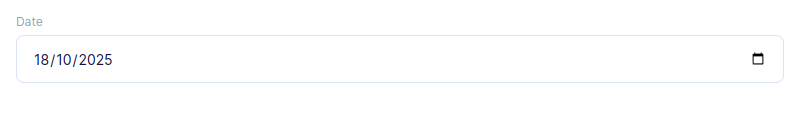
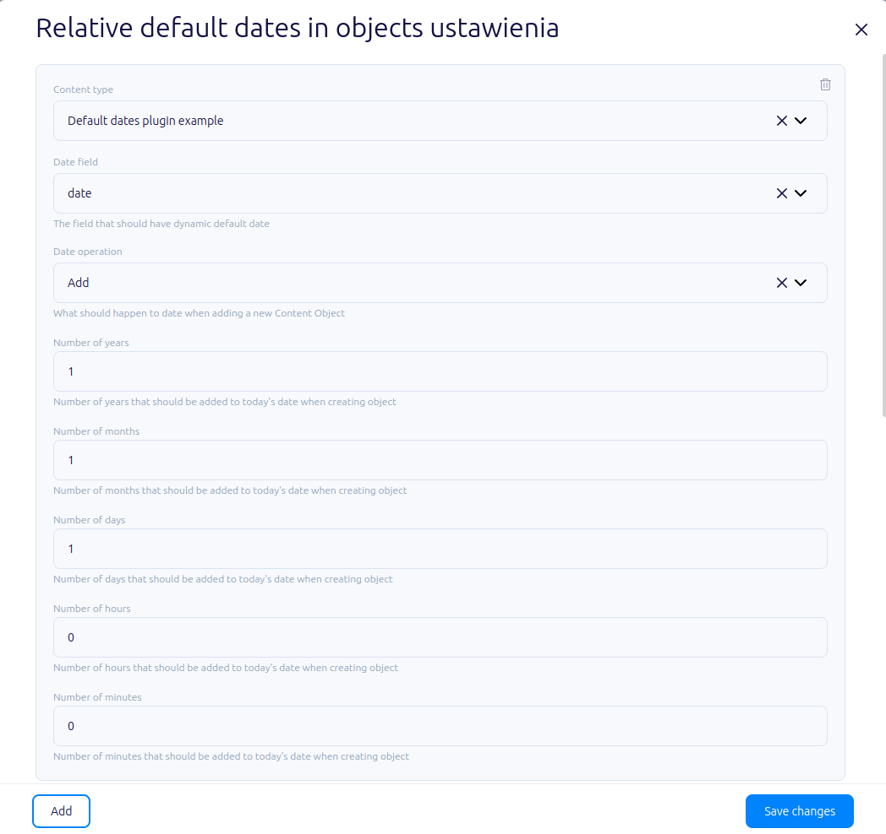

# About plugin

This plugin adds possibility of defining relative default dates in Content Objects.
It's particularly useful when Content Objects need timestamps visible for Content Editor.

## Plugin outcome

In the Content Object form, when adding new object the date field specified will be automatically populated
based on the settings (to now; future defined by adding years, months, days, hours and minutes;
or past defined by subtracting years, months, days, hours and minutes).



## Configuring plugin

To manage a plugin, you must first add it to your plugins.
Click the "+" icon to add the plugin to your library and click the "Manage" button. It will open the plugin settings.



Field descriptions:

* `Content Type` - Defines the type of objects for which the dates will be generated.
* `Date field` - Determines the field with date.
* `Date operation` - Specifies what should happen to date when adding a new Content Object.
* `Number of years` - Number of years that should be added to/subtracted from today's date when creating object.
* `Number of months` - Number of months that should be added to/subtracted from today's date when creating object.
* `Number of days` - Number of days that should be added to/subtracted from today's date when creating object.
* `Number of hours` - Number of hours that should be added to/subtracted from today's date when creating object.
* `Number of minutes` - Number of minutes that should be added to/subtracted from today's date when creating object.

# Development

## Quickstart:

1. `yarn`
2. `yarn start`
3. work work work
4. update your `src/plugin-manifest.json` file to contain the production URL and other plugin information
5. `yarn build`
6. paste js code from `./build/static/js/main.xxxxxxxx.js` to Flotiq console
7. navigate to affected Flotiq pages


## Deployment

<!-- TO DO -->

## Loading the plugin

### URL

1. Open Flotiq editor
2. Open Chrome Dev console
3. Execute the following script
   ```javascript
   FlotiqPlugins.loadPlugin('plugin-id', '<URL TO COMPILED JS>')
   ```
4. Navigate to the view that is modified by the plugin

### Directly

1. Open Flotiq editor
2. Open Chrome Dev console
3. Paste the content of `static/js/main.xxxxxxxx.js` 
4. Navigate to the view that is modified by the plugin

### Deployment

1. Open Flotiq editor
2. Add a new plugin and paste the URL to the hosted `plugin-manifest.json` file (you can use `https://localhost:3050/plugin-manifest.json` as long as you have accepted self-signed certificate for this url)
3. Navigate to the view that is modified by the plugin
